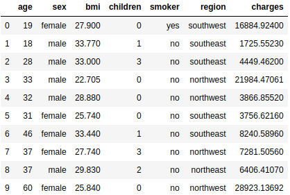
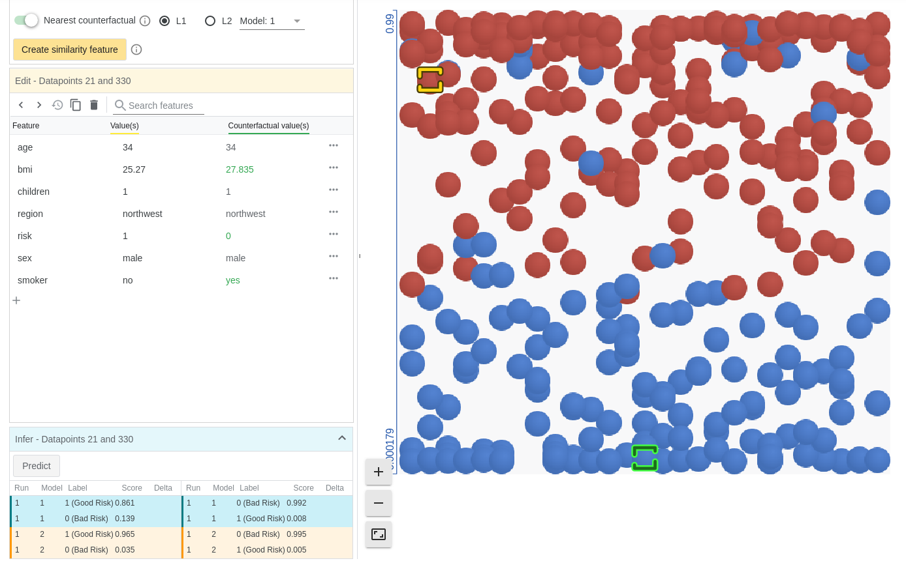
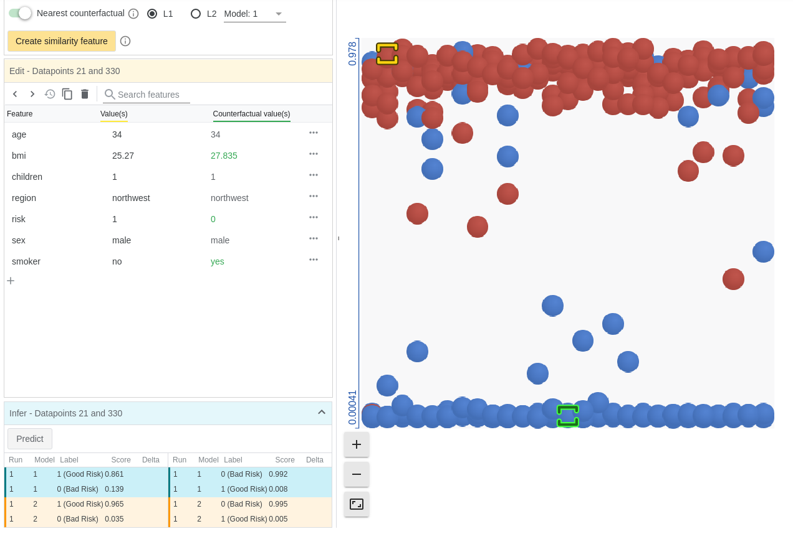
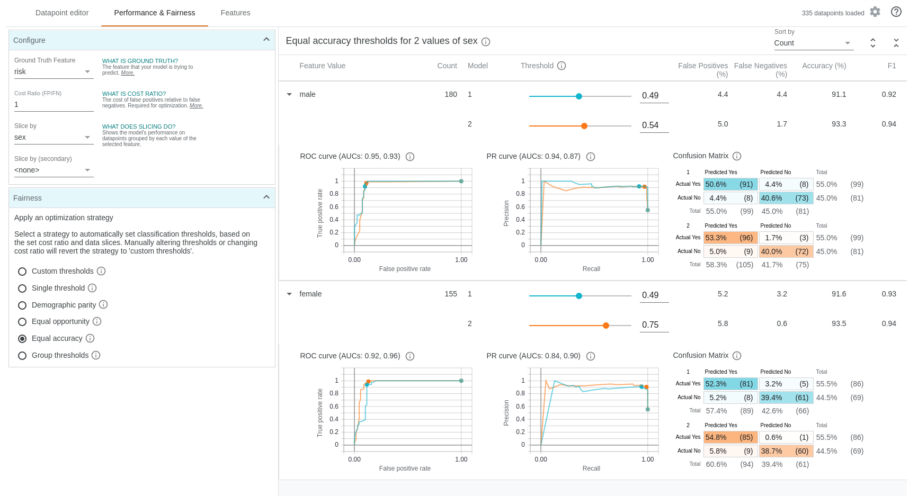

# Model Evaluation using What-If-Tool

In this demo we would like to showcase the What-If-Tool, and discuss how it can be used for investigating machine learning models to generate transparency and fairness evaluations, all visually in the dashboard.

We use an open source synthetic insurance dataset to build different versions of Predictive Underwriting models to predict risk scores, put them into What-If-Tool, and illustrate some of the key findings.

## Data

We use a synthetic dataset of insurance for building our Predictive Underwriting model

### Context
Machine Learning with R by Brett Lantz is a book that provides an introduction to machine learning using R. Packt Publishing does not make its datasets available online unless you buy the book and create a user account which can be a problem if you are checking the book out from the library or borrowing the book from a friend. All of these datasets are in the public domain but simply needed some cleaning up and recoding to match the format in the book.

### Content



* age: age of primary beneficiary

* sex: insurance contractor gender, female, male

* bmi: Body mass index, providing an understanding of body, weights that are relatively high or low relative to height,
objective index of body weight (kg / m ^ 2) using the ratio of height to weight, ideally 18.5 to 24.9

* children: Number of children covered by health insurance / Number of dependents

* smoker: Smoking

* region: the beneficiary's residential area in the US, northeast, southeast, southwest, northwest.

* charges: Individual medical costs billed by health insurance

### Acknowledgements
The dataset is available on GitHub [here](https://github.com/stedy/Machine-Learning-with-R-datasets).

### Inspiration
Can you accurately predict insurance costs?

## Model

We want to tackle the tasks in the following way:

1. Predictive Underwriting

    We simply convnert the insurance costs into "Good Risk" and "Bad Risk" so it becomes a binary classification problem:
    
    ```python
    def good_risk(row):
        if row['charges'] > 10000:
            return False
        else:
            return True
    
    df_puw['risk'] = df.apply(good_risk, axis=1)
    ```
    
    Then we build the 3 models:

    a. Decision Tree 
    
    ```python
    from sklearn.tree import DecisionTreeClassifier
    ```

    b. Logistic Regression
    
    ```python
    from sklearn.linear_model import LogisticRegression
    ```

    c. XGBoost
    
    ```python
    from xgboost.sklearn import XGBClassifier()
    ```

    We use the same pre-processing steps like ```SimpleOneHotEncoder()``` for categorical features and ```StandardScaler()``` for numerical features.

2. Dynamic Pricing

    Here we treat the insurance cost as it is and build a XGBoost regression model:
    
    ```python
    from xgboost.sklearn import XGBRegressor()
    ```
    
    Same pre-pocessing steps are used as in Predictive Underwriting models.

## Model Evaluation

We now fire up the What-If-Tool with the Logistic Regression and XGBoost models for Predictive Underwriting with testing data.

```python
#fire up the tool
config_builder = (
    WitConfigBuilder(test_examples.values.tolist(), test_examples.columns.tolist())
    .set_custom_predict_fn(customized_prediction_logistic_regression)
    .set_compare_custom_predict_fn(customized_prediction_xgboost)
    .set_target_feature('risk')
    .set_model_type('classification')
    .set_label_vocab(['Bad Risk', 'Good Risk'])
)

WitWidget(config_builder, height=1000)
```

Now let look at some of the key functions of this tool.

### Data Point Visualization

We can visualize the ground truth data and see how it is scattered in the risk score our model produces.

For Logistic Regression:



For XGBoost:



Obviously XGBoost gives a much more clear distinction between Good Risks (scores close to 1) and Bad Risks (score close to 0) than Logistic Regression.

We can click on individual data point to find his/her detailed feature values, and very importantly find the nearest counterfactual data point compared to him/her. The nearest counterfactual (neighbor of different classification) compares the selected datapoint with its nearest neighbor from a different classification using L1 or L2 distance. If a custom distance function is set, it uses that function instead.

Both the above pictures give the same conterfactual data point example. The two policyholders are almost identical except that one is a smoker and another is not, and they are categorized into different risks.

You can even directly edit the feature values to create new synthetic data point of a policyholder and run model inference to get the risk score.

### Fairness

By default the threshold we set for classifying the risk score into good/bad risks is 0.5.

However this threshold can be fine tuned to meet different fairness standards. An excellent article on different fairness attributes is [here](https://pair-code.github.io/what-if-tool/ai-fairness.html).

Specifically, let say the slice is on gender for male and female policyholders:

* Single Threshold: Optimize a single risk threshold for all policyhoders
* Group Threshold: Optimize a separate risk threshold for male and female
* Demographic parity: Similar percentages of policyhoders of male and female are predicted as Good Risks
* Equal opportunity: Among those policyholders with the ground truth Good Risk label, there is a similar percentage of Good Risk prediction for male and female
* Equal accuracy: There is a similar percentage of correct predictions of risk for male and female.

The tool enables us to optimize our model for different fiarness metrics by tunning the threshold:



We can extend the tool so that for each risk threshold we can calculate the expected loss ratio.

There are also many other functions like feature exploration (you can even add in Shap values for the feature importance visualizations by referencing to [this jupyternotebook](https://github.com/PAIR-code/what-if-tool/blob/master/WIT_COMPAS_with_SHAP.ipynb)).